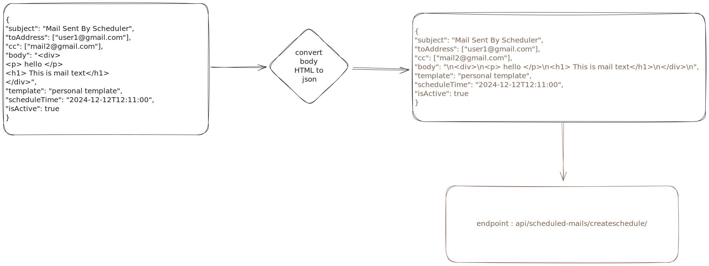

# Mail Scheduler

## User Schedule One-To-Many relation

### HTML to JSON parsing

<svg version="1.1" xmlns="http://www.w3.org/2000/svg" viewBox="0 0 701.7538373280131 536.5270006482493" width="701.7538373280131" height="536.5270006482493">
  <!-- svg-source:excalidraw -->

  <defs>
    

  </defs>
  <g stroke-linecap="round" transform="translate(10 10) rotate(0 66.61806800813676 22.064583034542125)"><path d="M0 0 C0 0, 0 0, 0 0 M0 0 C0 0, 0 0, 0 0 M-0.6 22.32 C9.41 13.36, 12.2 3.18, 23.12 -2.21 M2.25 23.99 C6.57 15.69, 11.32 10.03, 21.7 0.75 M0.87 48.32 C16.71 31.16, 29.56 13.86, 39.52 0.22 M1.34 44.71 C15.49 29.1, 30.14 11.97, 43.07 -1.6 M20.75 49.04 C32.78 30.47, 48.24 19.9, 61.84 -1.19 M23.88 46.86 C33.26 32.21, 43.57 22.06, 64.41 -0.17 M48.64 44.52 C61 32.04, 72.74 12.86, 84.07 -1.33 M46.42 46.53 C57.5 31.31, 70.31 14.38, 84.79 -0.92 M68.32 45.65 C78.05 35.14, 90.06 18.06, 104.13 -1.25 M67.39 44.77 C74.34 33.61, 85.49 25.93, 107.8 -1.71 M88.51 43.89 C101.58 30.5, 110.35 18.74, 126.4 -0.5 M86.22 45.95 C102.68 28.37, 115.15 14.38, 126.3 2.03 M110.05 46.73 C118.45 33.67, 129.92 20.15, 140.85 10.24 M108.76 47.87 C114.95 34.21, 126.05 25.61, 141.9 9.37 M127.73 45.53 C129.52 44.64, 136.38 42.14, 143.43 30.62 M129.4 46.29 C133.06 43.93, 137.86 36.89, 143.67 30.06" stroke="#ffc9c9" stroke-width="2" fill="none"></path><path d="M0.74 -0.58 C32.4 -3.89, 69.29 -1.16, 135.67 1.91 M133.99 -0.79 C133.75 13.45, 134.14 25.17, 136.3 40.36 M137.2 40.89 C104.12 44.22, 69.39 46.41, -1.68 46.6 M-3.97 41.15 C4.18 32.31, 1.74 22.55, -3.68 -0.89" stroke="#1e1e1e" stroke-width="4.5" fill="none" stroke-dasharray="1.5 10"></path></g><g transform="translate(47.94809272737504 19.564583034542125) rotate(0 28.66997528076172 12.5)"><text x="28.66997528076172" y="17.619999999999997" font-family="Excalifont, Xiaolai, Segoe UI Emoji" font-size="20px" fill="#1e1e1e" text-anchor="middle" style="white-space: pre;" direction="ltr" dominant-baseline="alphabetic">user 1</text></g><g stroke-linecap="round" transform="translate(550.3986306380315 10.073882371051923) rotate(0 66.61806800813676 22.064583034542125)"><path d="M0 0 C0 0, 0 0, 0 0 M0 0 C0 0, 0 0, 0 0 M2.8 13.9 C2.12 11.74, 4.15 3.85, 12.1 0.43 M0.39 11.39 C2.46 8.52, 6.56 2.82, 9.46 1.08 M-1.09 21.61 C6.81 15.38, 20.2 8.53, 24.2 -0.27 M1.76 23.52 C6.84 16.26, 17.91 4.8, 22.9 0.72 M1.32 40.86 C13.47 22.3, 22.37 9.71, 35.68 3.05 M1.01 35.4 C11.71 21.51, 25.53 8.81, 32.16 0.68 M4.32 42.5 C9.69 36.44, 21.43 26.68, 45.64 -0.97 M0.59 44.66 C13.67 33.52, 27.69 20.46, 41.14 -0.99 M11.26 46.22 C20.52 34.29, 34.9 20.12, 55.81 -1.61 M14.01 44.82 C19.87 36.84, 29.83 26.37, 52.55 -1.17 M21.04 47.27 C34.36 33.81, 38.4 24.87, 65.77 -2.81 M22.37 47.55 C35.48 32.05, 47.03 19.55, 63.24 -1.93 M35.26 44.2 C41.26 29.41, 60.72 17.09, 71.83 -0.05 M34.22 44.81 C44.56 36.44, 54.26 22.93, 73.7 0.89 M41.26 46.98 C56.83 30.49, 77.52 6.31, 85.9 -1.24 M43.31 45.28 C56.52 32.9, 68.82 20.07, 83.65 -0.87 M54.33 48.93 C62.49 35.39, 70.89 25.6, 94.39 -3.56 M55.44 44.57 C67.95 32.4, 81.15 16.93, 97.62 -0.23 M63.22 46.82 C74.65 39.23, 85.06 27.07, 109.04 1.61 M64.68 45.65 C79.26 31.33, 91.54 14.26, 104.48 -1.69 M77.06 48.5 C93.35 27.42, 102.86 19.37, 117.18 -3.37 M76.96 44.8 C88.5 35.15, 97.88 20.72, 114.36 -1 M86.85 45.05 C100.65 29.74, 111.26 20.41, 127.2 1.66 M86.32 48.04 C96.03 37.05, 105.27 29.59, 128.83 1.28 M99.71 46.59 C108.79 33.15, 123.3 16.5, 137.57 0.6 M97.75 45.32 C102.66 39.26, 111.46 26.96, 136.57 1.95 M105.75 49.5 C112.09 40.11, 125.76 30.91, 139.63 16.22 M108.79 45.94 C118.04 35.06, 123.42 28.63, 136.95 12.66 M120.91 47.44 C126.2 42.1, 127.26 33.85, 135.56 23.38 M117.1 48.02 C124.5 43.75, 127.13 37.72, 136.55 25.44 M129.65 46.4 C130.7 44.47, 132.7 44.13, 134.8 37.01 M129.69 46.08 C130.87 42.3, 135.21 40.76, 136.58 38" stroke="#b2f2bb" stroke-width="1" fill="none"></path><path d="M-1.77 1.94 C48.58 -2.91, 92.32 -1.37, 136.02 2.75 M-0.9 0.69 C29.29 0.02, 59.35 -2.71, 134.61 -1.7 M130.57 -1.3 C131.15 6.45, 134.85 16.63, 136.54 47.38 M134.18 0.1 C134.9 8.52, 133.02 21.68, 133.46 43.16 M133.34 42.83 C107.19 46.62, 80.99 44.91, 0.82 45.98 M134.4 44.52 C84.58 44.46, 40.98 42.77, -1.74 43.92 M3.14 41.34 C-2.8 32.6, -0.79 18.15, 0.59 -2.48 M0.5 45.18 C1.71 36.26, 0.59 26.7, -1.89 -0.53" stroke="#1e1e1e" stroke-width="2" fill="none"></path></g><g transform="translate(598.2767160411877 19.638465405594047) rotate(0 18.73998260498047 12.5)"><text x="18.73998260498047" y="17.619999999999997" font-family="Excalifont, Xiaolai, Segoe UI Emoji" font-size="20px" fill="#1e1e1e" text-anchor="middle" style="white-space: pre;" direction="ltr" dominant-baseline="alphabetic">sc 1</text></g><g stroke-linecap="round" transform="translate(556.1554415929273 286.54615440359885) rotate(0 66.61806800813676 22.064583034542125)"><path d="M0 0 C0 0, 0 0, 0 0 M0 0 C0 0, 0 0, 0 0 M-2.76 9.08 C2.24 6.52, 7.41 5.17, 12.7 0.15 M1.46 11.45 C3.88 7.99, 4.29 7.88, 11.64 -0.24 M4.19 24.91 C5.74 15.64, 13.5 8.82, 23.61 -2.86 M0.95 25.78 C5.07 17.53, 10.95 11.17, 23.03 0.31 M-2.5 40.49 C8.59 28.32, 14.04 19.47, 30.88 1.5 M1.08 35.93 C11.5 23.18, 23.5 7.55, 33.23 -1.42 M2.79 47.35 C22.07 24.37, 37.03 9.45, 43.73 -3.74 M3.18 42.44 C16.86 31.36, 27.84 14.83, 42.67 -1.83 M11.21 41.26 C25.28 28.41, 39.38 11.36, 51.06 2.04 M14.41 43.93 C28.51 29.35, 42.03 15.29, 53.87 -1.04 M28.57 46.4 C39.23 28.09, 54.36 11.94, 65.14 -4.08 M26.24 42.58 C31 36.22, 42.72 24.61, 65.17 -1.37 M37.6 40.89 C47.13 31.61, 58.03 15.08, 72.65 2.33 M35.02 44.28 C45.6 30.47, 60.03 19.02, 74.14 0.2 M46.46 47.19 C57.88 31.55, 64.39 25.72, 85.89 -4.05 M46.85 45.8 C60.08 30.83, 72.7 13.54, 87.04 1.61 M59.91 43 C73.84 26.57, 79.79 12, 93.84 0.55 M54.99 44.31 C71.29 28.67, 82.61 13.31, 94.22 -0.7 M70.41 44.14 C74.43 34.16, 86.89 20.13, 105.34 -0.11 M67.33 44.98 C80.94 27.09, 95.96 12.53, 107.61 -2.29 M77.24 47.39 C84.48 36.6, 97.94 23.5, 115.51 -2.67 M79.79 42.5 C88.58 29.43, 101.35 14.66, 115.45 1.68 M85.68 41.39 C103.3 25.52, 115.92 18.22, 127.52 3.71 M87.8 44.67 C95.73 33.36, 107.71 23.53, 126.41 -1.08 M102.03 45.51 C113.61 34.19, 121.38 17.31, 135.85 1.25 M99.72 45.95 C110.76 32.58, 119.47 18.71, 133.08 4.68 M108.85 40.74 C115.9 37.93, 121.84 25.68, 137.28 13.41 M108.26 43.05 C117.71 37.93, 123.05 29.95, 133.36 18.23 M124 40.53 C124.13 39.24, 125.67 38.98, 137.23 27.41 M119.94 44.45 C121.91 38.84, 127.97 38.2, 133.03 30.13 M130.84 44.23 C132.18 42.67, 132.76 41.74, 133.81 42.06 M131.25 43.68 C131.93 42.85, 132.76 42.07, 133.57 41.85" stroke="#b2f2bb" stroke-width="1" fill="none"></path><path d="M0.11 2.79 C50.42 0.36, 98.36 1.74, 130.46 0.78 M-1.16 -1.59 C37.4 4.13, 80.06 3.72, 134.18 -0.56 M132.96 3.15 C133.19 15.16, 132.52 29.48, 134.31 46.44 M134.82 0.25 C133.06 10.36, 130.52 19.43, 134.79 45.05 M136.74 40.32 C82 44.32, 40.33 49.26, -2.73 43.03 M134.9 42.18 C81.52 43.49, 28.49 42.22, 1.48 45.93 M3.52 45.59 C-2.23 26.54, -4.44 7.87, -0.42 -2.89 M-0.33 46.12 C0.26 31.91, 2.08 19.98, -0.25 -2" stroke="#1e1e1e" stroke-width="2" fill="none"></path></g><g transform="translate(602.4535251650289 296.110737438141) rotate(0 20.319984436035156 12.5)"><text x="20.319984436035156" y="17.619999999999997" font-family="Excalifont, Xiaolai, Segoe UI Emoji" font-size="20px" fill="#1e1e1e" text-anchor="middle" style="white-space: pre;" direction="ltr" dominant-baseline="alphabetic">sc 4</text></g><g stroke-linecap="round" transform="translate(10.848637809020829 108.69952192572066) rotate(0 66.19374910362635 20.79162632101088)"><path d="M0 0 C0 0, 0 0, 0 0 M0 0 C0 0, 0 0, 0 0 M-3.43 21.58 C7.34 15.91, 11.22 15.05, 19.21 3.9 M-1.29 24.76 C6.86 18, 13.26 11.1, 20.84 -0.88 M4.81 42.73 C14.45 28.63, 34.26 15.95, 39.39 -2.47 M2.58 44.03 C14.14 32.33, 22.83 22.14, 41.48 -1.64 M25.43 45.24 C38.58 26.82, 53.98 11.81, 65.09 0.04 M23.59 45.55 C39.76 29.1, 53.52 14.67, 63.25 1.6 M46.8 43.15 C54.62 31.44, 67.58 18.3, 85.15 2.52 M43.69 44.49 C59.38 28.64, 73.01 15.66, 85.6 1.07 M67.55 45.09 C75.58 30.75, 86.27 15.49, 107.12 3.19 M66.67 46.8 C77.75 34.39, 84.09 25.29, 107.12 0.47 M90.05 42.07 C96.07 34.07, 107.96 23.84, 127.74 -0.99 M87.98 45.68 C97.72 34.73, 109.57 22.01, 126.3 1.29 M110.15 43.3 C118.68 35.8, 127.6 24.15, 144.1 9.04 M110.78 44.09 C122.37 32.99, 133.21 18.45, 141.02 6.94" stroke="#ffc9c9" stroke-width="2" fill="none"></path><path d="M2.83 0.02 C40.25 3.7, 75.48 0.04, 135.14 0.76 M133.68 -0.99 C135.64 7.89, 129.84 23.35, 132.57 45.55 M130.28 43.74 C101.71 44.03, 71.4 39.72, -1.4 37.62 M1.34 39.88 C-4.46 31.32, 2.57 24.74, 3.44 -1.53" stroke="#1e1e1e" stroke-width="4.5" fill="none" stroke-dasharray="1.5 10"></path></g><g transform="translate(45.64240827495186 116.99114824673154) rotate(0 31.399978637695312 12.5)"><text x="31.399978637695312" y="17.619999999999997" font-family="Excalifont, Xiaolai, Segoe UI Emoji" font-size="20px" fill="#1e1e1e" text-anchor="middle" style="white-space: pre;" direction="ltr" dominant-baseline="alphabetic">user 2</text></g><g stroke-linecap="round" transform="translate(551.2472684470523 107.66723040844965) rotate(0 66.19374910362635 20.79162632101088)"><path d="M0 0 C0 0, 0 0, 0 0 M0 0 C0 0, 0 0, 0 0 M1.99 11.41 C5.77 7.29, 3.79 6.55, 11.1 0.98 M-0.52 10.96 C4.1 7.53, 5.89 2.78, 11.75 1.21 M-2.2 22.5 C6.17 21.82, 13.91 14.58, 21.06 3.86 M-0.29 22.19 C7.94 17.86, 11.94 11.96, 22.05 0.85 M3.73 39.35 C7.03 26.39, 16.35 19.44, 35.05 3.17 M-1.74 37.16 C10.67 24.26, 24.29 8.68, 32.68 -1.2 M2.38 38.98 C16.5 30.31, 26.96 24.35, 41.69 -0.66 M4.54 40.91 C14.07 35.6, 21.65 24.34, 41.67 -1.09 M16.76 38.88 C25.45 33.14, 31.91 24.38, 51.71 -3.84 M15.36 40.52 C28.09 29.01, 38.35 15.55, 52.15 -2.02 M28.49 44.14 C34.76 28.61, 45.6 21.05, 61.17 -0.09 M28.76 40.78 C34.77 32.07, 43.73 24.72, 62.05 -0.4 M36.08 38.07 C48.84 29.41, 64.09 6.59, 74.6 -1.79 M36.69 41.52 C50.53 29.16, 59.19 18.02, 75.54 1.69 M49.52 38.34 C63.96 29.32, 70.66 14.46, 84.08 -1.09 M47.82 42.39 C59.73 30.99, 71.19 14.96, 84.45 -1.9 M61.38 39.81 C66.24 30.07, 74.84 22.04, 92.42 0.98 M57.02 40.49 C67.85 31.42, 75.4 26.57, 95.75 -1.84 M69.93 41.5 C82.51 32.12, 90.5 22.83, 108.25 1.37 M68.76 41.87 C82.57 26.66, 93.62 12.66, 104.95 0.25 M82.28 45.38 C85.59 30.93, 101.95 21.41, 112.53 -1.37 M78.58 43.15 C88.69 32.85, 94.02 21.36, 114.9 0.08 M89.49 43.27 C94.55 34.15, 105.59 25.53, 128.22 -3.23 M92.48 43.02 C103.84 29.52, 118.7 14.94, 127.84 1.3 M101.7 39.74 C112.32 30.52, 119.71 23.19, 130.32 2.72 M100.42 39.86 C115.82 26.45, 125.01 14.4, 131.67 5.55 M115.27 38.94 C121.48 37.25, 127.86 29.08, 134.03 18.11 M111.71 43.27 C115.21 34.65, 123.1 31.31, 130.47 18.99 M123.59 43.09 C127.44 36.13, 129.09 34.59, 130.1 27.74 M124.02 43.17 C126.28 39.88, 127.23 36.98, 131.64 29.06" stroke="#b2f2bb" stroke-width="1" fill="none"></path><path d="M1.94 1.31 C50.51 -1.05, 103.89 3.96, 135.14 -2.89 M0.69 -1.07 C33.85 -0.18, 63.22 2.56, 130.68 -1.55 M131.09 -2.26 C129.27 14.72, 129.65 29.85, 135.64 38.53 M132.49 1.93 C130.65 11.3, 133.94 22.74, 131.42 39.6 M131.09 42.33 C104.06 42.99, 72.67 42.47, 1.85 43.63 M132.78 39.7 C89.74 44.42, 44.47 41.38, -0.21 41.16 M-2.79 39.28 C1.53 26.47, -0.61 12.52, -2.48 -3.23 M1.06 42.85 C2.41 31.35, 2.53 18.93, -0.53 1.61" stroke="#1e1e1e" stroke-width="2" fill="none"></path></g><g transform="translate(595.9710315887646 115.95885672946054) rotate(0 21.469985961914062 12.5)"><text x="21.469985961914062" y="17.619999999999997" font-family="Excalifont, Xiaolai, Segoe UI Emoji" font-size="20px" fill="#1e1e1e" text-anchor="middle" style="white-space: pre;" direction="ltr" dominant-baseline="alphabetic">sc 2</text></g><g stroke-linecap="round" transform="translate(557.0040794019482 383.03332855267365) rotate(0 66.19374910362635 20.79162632101088)"><path d="M0 0 C0 0, 0 0, 0 0 M0 0 C0 0, 0 0, 0 0 M-2.82 10.91 C2.66 8.1, 9.38 4.89, 10.82 -2.73 M-0.46 13.31 C0.89 8.72, 5.61 7.76, 10.42 0.6 M1.09 22.58 C6.96 14.79, 15.3 9.99, 18.47 -1.64 M1.96 23.04 C4.63 17.93, 9.23 14.97, 21.64 -0.94 M3.35 37.92 C12.22 22.26, 24.35 9.77, 33.49 3.66 M-1.21 36.69 C13.42 20.89, 25.16 8.36, 30.58 1.77 M8.74 45.17 C14.41 32.25, 28.18 17.87, 38.92 1.32 M3.83 42.56 C20.5 26.11, 31.69 13.21, 40.83 0.42 M13.32 40.9 C28.8 27.11, 40.08 9, 55.37 1.76 M15.99 42.96 C29.13 28.98, 42.77 14.77, 52.28 1.18 M29.12 41.27 C35.23 32.29, 43.48 24.27, 59.91 -3.91 M25.3 40.36 C40.87 29.02, 51.18 13.84, 62.61 0.35 M34.27 40.86 C51.12 25.49, 60.69 13.45, 76.98 -0.73 M37.66 40.58 C46.92 32.4, 58.47 18.57, 74.85 -2.19 M51.24 45.1 C53.11 33.93, 64.85 23.15, 81.27 1.2 M49.85 43.49 C64.2 26.4, 76.24 10.81, 86.93 0.38 M57.72 45.35 C64.68 28, 73.53 19.82, 96.53 1.86 M59.03 42.47 C69.81 28.56, 80.86 16.76, 95.28 -0.65 M69.52 38.08 C84.3 25.05, 95.06 12.41, 106.54 2.46 M70.36 41.79 C83.52 25.86, 99.97 9.89, 104.36 -2.14 M83.43 39.95 C91.8 34.08, 97.9 18.28, 113.23 1.27 M78.54 40.12 C90.92 26.93, 101.67 14.27, 117.58 1.1 M88.09 42.95 C95.43 33.56, 111.35 23.43, 130.27 -2.22 M91.37 39.9 C101.89 30.11, 113.84 15.39, 125.48 0.74 M102.88 45.55 C115.44 29, 122.42 17.64, 128.7 6.33 M103.32 42.85 C110.85 30.74, 117.89 20.17, 132.13 6.94 M108.78 39.76 C121.01 31.06, 123.8 31.48, 128.95 16.2 M111.09 43.33 C117.81 37.31, 121.67 29.89, 133.78 16.68 M120.1 42.2 C124.59 37.57, 129.87 37.1, 131.42 28.21 M123.04 40.31 C124.02 39.72, 128.69 35.23, 133.47 31.56" stroke="#b2f2bb" stroke-width="1" fill="none"></path><path d="M2.79 2.14 C27.98 1.73, 56.16 -2.85, 133.16 -0.27 M-1.59 -1.68 C30.64 3.44, 59.12 2.48, 131.83 0.72 M135.54 0.49 C131.96 9.77, 131.45 20.98, 134.7 39.26 M132.64 0.56 C132.84 7.01, 131.23 19.51, 133.31 42.82 M128.58 38.52 C100.27 47.36, 74.7 41.17, -1.1 45.08 M130.44 41.5 C86.54 42.31, 37.95 45.27, 1.8 43.46 M1.46 39.86 C-0.02 22.79, -1.3 11.45, -2.89 -0.7 M1.99 41.29 C1.06 33.23, 1.59 21.57, -2 -1.4" stroke="#1e1e1e" stroke-width="2" fill="none"></path></g><g transform="translate(602.5478498678792 391.32495487368453) rotate(0 20.649978637695312 12.5)"><text x="20.649978637695312" y="17.619999999999997" font-family="Excalifont, Xiaolai, Segoe UI Emoji" font-size="20px" fill="#1e1e1e" text-anchor="middle" style="white-space: pre;" direction="ltr" dominant-baseline="alphabetic">sc 5</text></g><g stroke-linecap="round" transform="translate(13.21089752783314 209.50376749095165) rotate(0 66.19374910362635 20.79162632101088)"><path d="M0 0 C0 0, 0 0, 0 0 M0 0 C0 0, 0 0, 0 0 M3.68 25.2 C9.15 16.33, 13.4 13.27, 21.88 0.09 M-1.48 24.49 C7.3 16.74, 8.94 10.91, 21 1.8 M2.48 46.03 C20.56 25.47, 37.19 7.96, 44.37 -2.94 M3.58 44.81 C14.45 30.75, 27.74 16.86, 42.31 0.67 M27.82 43.12 C36.67 32.56, 45.23 19.72, 64.47 -1.7 M26.2 45.57 C36.03 33.72, 45.02 17.75, 65.1 -0.91 M47.66 43.84 C55.61 30.39, 66.77 18.88, 85.98 2.87 M47.2 45.12 C59.4 29.83, 73.32 16.05, 87.02 -1.87 M68.59 47.79 C80.98 28.02, 102.43 11.66, 107.81 -1.42 M68.03 46.77 C83.79 25.57, 99.02 9.35, 105.63 -1.46 M85.31 42.57 C101.96 28.96, 112.56 15.03, 130.38 -2.39 M86.64 45.25 C97.86 33.06, 106.3 22.12, 125.22 1.06 M106.4 43.63 C114.24 37.83, 123.53 31.47, 138.9 7.89 M107.48 43.28 C122.99 30.47, 134.26 16.11, 142.28 8.49" stroke="#ffc9c9" stroke-width="2" fill="none"></path><path d="M1.27 2.1 C43.38 -2.71, 90.87 0.34, 132.75 0.99 M135.25 3.73 C128.64 8.42, 129.4 19.45, 131.74 39.11 M132.23 39.71 C92.95 36.64, 60.87 36.39, -2.15 41.94 M-1.25 42.52 C1.71 28.4, 2.45 12.66, -1.97 -2.97" stroke="#1e1e1e" stroke-width="4.5" fill="none" stroke-dasharray="1.5 10"></path></g><g transform="translate(48.92467379210402 217.79539381196253) rotate(0 30.47997283935547 12.5)"><text x="30.47997283935547" y="17.619999999999997" font-family="Excalifont, Xiaolai, Segoe UI Emoji" font-size="20px" fill="#1e1e1e" text-anchor="middle" style="white-space: pre;" direction="ltr" dominant-baseline="alphabetic">user3 </text></g><g stroke-linecap="round" transform="translate(553.6095281658646 207.3653020853577) rotate(0 66.19374910362635 20.79162632101088)"><path d="M0 0 C0 0, 0 0, 0 0 M0 0 C0 0, 0 0, 0 0 M-0.5 14.55 C1.13 6.76, 6.16 6.91, 11.64 1.04 M-0.94 12.69 C3.6 6.52, 6.84 4.14, 11.88 -0.67 M-1.31 24.42 C10.16 20.23, 15.06 10.7, 25.19 -0.93 M-1.62 25.7 C6.09 17.79, 12.29 12.63, 22.18 -0.4 M2.22 35.43 C10.99 22.01, 25.81 13.42, 35.16 3.07 M0.02 35.76 C11.39 25.81, 20.14 14.45, 30.79 -1.24 M2.64 44.56 C18.05 30.77, 36.22 10.04, 42 -4.04 M4.57 42.62 C17.4 32.31, 24.18 19.91, 41.57 -1.24 M13.2 42.18 C29.11 26.63, 41.96 14.71, 49.49 -0.05 M14.84 43.16 C29.42 27.34, 42.1 10.81, 51.31 -0.61 M29.13 40.28 C39.53 24.41, 57.82 6.73, 63.9 -4.02 M25.77 41.46 C33.32 33.6, 42.16 22.36, 63.59 1.53 M33.72 39.24 C53.5 26.63, 59.15 14.61, 72.86 -1.19 M37.16 43.94 C44.05 34.12, 52.14 26.13, 76.34 0.64 M44.65 44.29 C58.21 29.01, 65.82 22.55, 84.23 0.16 M48.7 42.05 C61.78 29.34, 70.12 15.7, 83.42 -1.84 M56.79 40.64 C65.38 30.35, 75.67 17.68, 96.96 -4.18 M57.47 43.76 C69.51 30.11, 85.79 13.86, 94.14 -1.04 M69.15 44.54 C79.14 33.37, 89.15 25, 108.02 0.81 M69.52 42.95 C79.73 29.01, 91.1 14.46, 106.9 -1.23 M83.69 38.47 C92.45 30.71, 106.16 8.73, 114.53 -2.78 M81.45 42.87 C93.13 26.04, 103.66 11.55, 115.98 -1.62 M92.24 38.24 C101.76 30.41, 111.78 19.65, 123.33 2.33 M91.99 41.57 C100.91 34.15, 108.71 24.1, 127.86 0.06 M99.37 44.12 C110.6 30.75, 123.75 16.01, 128.66 10.33 M99.5 43.34 C107.21 32.51, 116.29 25.5, 131.49 7.56 M109.25 43.95 C122.58 35.13, 129.4 27.99, 132.14 16.29 M113.57 40.15 C118.02 34.69, 127.76 23.13, 133.03 18.44 M124.06 43.65 C124.15 38.08, 129.67 30.86, 129.87 28.68 M124.14 42.75 C125.78 38.66, 127.79 35.67, 131.19 30.32" stroke="#b2f2bb" stroke-width="1" fill="none"></path><path d="M1.31 -1.34 C45.31 -1.08, 97.85 1.47, 129.5 -2.3 M-1.07 1.74 C46.88 -1.91, 97.87 -2.61, 130.83 0.39 M130.13 -3.36 C133.27 10.72, 135.13 30.68, 129.33 40.41 M134.31 -1.35 C132.82 12.49, 133.01 20.13, 130.41 40.07 M133.13 42.94 C88.38 40.37, 42.51 42.57, 2.04 42.75 M130.5 42.51 C96.9 41.34, 57.08 41.89, -0.42 42.71 M-2.3 42.36 C-0.94 31.54, -0.06 21.75, -3.23 -2.01 M1.27 43.39 C-0.06 34.06, -2.09 22.18, 1.61 -0.82" stroke="#1e1e1e" stroke-width="2" fill="none"></path></g><g transform="translate(599.2532971059168 215.6569284063686) rotate(0 20.54998016357422 12.5)"><text x="20.54998016357422" y="17.619999999999997" font-family="Excalifont, Xiaolai, Segoe UI Emoji" font-size="20px" fill="#1e1e1e" text-anchor="middle" style="white-space: pre;" direction="ltr" dominant-baseline="alphabetic">sc 3</text></g><g stroke-linecap="round" transform="translate(559.3663391207605 484.94374800622757) rotate(0 66.19374910362635 20.79162632101088)"><path d="M0 0 C0 0, 0 0, 0 0 M0 0 C0 0, 0 0, 0 0 M-1 10.67 C4.9 8.92, 10.36 3.28, 7.94 -2.85 M1.4 10.78 C3.37 8.72, 8.98 2.66, 11.26 0.48 M-1.23 24.05 C6.3 16.86, 16.89 4.25, 19.69 -3.18 M-0.78 24.12 C7.22 14.77, 17.39 6.25, 20.38 1.09 M0.79 37.41 C6.1 28.6, 14.53 20.21, 35.65 3.81 M-0.45 37.64 C7.5 26.42, 18.79 14.93, 33.77 -0.03 M8.83 40.07 C21.8 27.15, 33.27 8, 43.98 1.72 M6.22 43.69 C13.63 32.29, 24.57 20.01, 43.08 1.34 M15.22 40.65 C27.88 26.6, 36.13 20.57, 55.08 1.1 M17.28 42.37 C27.31 32.51, 37.1 18.43, 54.5 -1.79 M26.26 42 C36.59 30.14, 47.98 14.42, 60.08 1.6 M25.34 43.2 C39.55 28.79, 49.99 16.17, 64.34 0.05 M36.51 43.82 C44.71 30.57, 56.28 21.33, 73.92 -1.15 M36.23 40.39 C47.84 32.51, 53.77 23.96, 72.46 -1.59 M51.41 38.76 C63.28 26.21, 75.54 7.28, 86.51 3.33 M49.81 43.71 C60.9 27.36, 73.53 16.33, 85.7 -1.6 M62.33 39.33 C66.77 26.02, 80.46 15.46, 97.84 -0.73 M59.45 42.02 C68.12 30.62, 78.8 17.96, 95.33 0.32 M65.73 44.8 C79.08 29.06, 92.91 13.52, 109.11 3.47 M69.43 40.84 C79.05 32.33, 88.61 19.39, 104.5 -0.8 M78.26 44 C96.99 24.49, 105.76 8.2, 117.17 1.01 M78.42 41.94 C92.26 25.79, 106.7 11.6, 117 -0.9 M91.93 38.28 C104.75 32, 116.75 17.35, 124.34 1.03 M88.87 40.87 C100.53 31.72, 107.19 21.33, 127.3 1.68 M105.18 44.32 C110.1 29.98, 120.26 18.44, 132.27 6.22 M102.48 42.52 C112.13 26.9, 123.34 15.21, 132.89 6.32 M110.07 45.04 C116.25 33.02, 131.54 20.51, 130.24 16.55 M113.63 42.72 C121.35 32.71, 127.61 25.54, 130.71 18.58 M123.16 40.79 C125.92 38.71, 132.84 31.83, 130.34 29.34 M121.28 40.25 C125.77 39.89, 126.35 37.82, 133.69 29" stroke="#b2f2bb" stroke-width="1" fill="none"></path><path d="M2.14 1.17 C45.53 0.7, 84.7 -1.07, 132.12 -3.27 M-1.68 1.75 C29.79 3.44, 56.71 1.54, 133.11 -1.21 M132.87 0.33 C132.15 8.51, 133.41 19.7, 130.06 38.22 M132.95 -0.31 C131.07 14.39, 134.6 33.55, 133.62 40.19 M129.33 39.97 C87.16 42.39, 32.28 37.96, 3.5 43.88 M132.3 43.05 C101.68 39.21, 75.42 40.8, 1.88 42.73 M-1.73 41.37 C-4.67 28.58, -1.15 15.69, -0.7 -2.5 M-0.29 41.83 C1.67 33.92, -0.11 22.69, -1.4 -1.92" stroke="#1e1e1e" stroke-width="2" fill="none"></path></g><g transform="translate(604.6901083659884 493.23537432723845) rotate(0 20.869979858398438 12.5)"><text x="20.869979858398438" y="17.619999999999997" font-family="Excalifont, Xiaolai, Segoe UI Emoji" font-size="20px" fill="#1e1e1e" text-anchor="middle" style="white-space: pre;" direction="ltr" dominant-baseline="alphabetic">sc 6</text></g><g stroke-linecap="round"><g transform="translate(156.81434096060713 33.098431091585894) rotate(0 194.7623771702851 -0.7991463050144603)"><path d="M0.63 0.45 C66.05 0.9, 327.55 1.35, 391.98 0.59 M-2.47 -1.78 C62.84 -1.89, 325.2 -3.14, 391.08 -3.23" stroke="#1e1e1e" stroke-width="2" fill="none"></path></g><g transform="translate(156.81434096060713 33.098431091585894) rotate(0 194.7623771702851 -0.7991463050144603)"><path d="M367.93 7.15 C375.83 1.27, 379.09 0.56, 389.8 -3.82 M366.97 5.82 C372.83 2.4, 379.98 -0.05, 391.31 -2.27" stroke="#1e1e1e" stroke-width="2" fill="none"></path></g><g transform="translate(156.81434096060713 33.098431091585894) rotate(0 194.7623771702851 -0.7991463050144603)"><path d="M367.87 -9.95 C375.66 -11.03, 378.93 -6.94, 389.8 -3.82 M366.92 -11.29 C372.9 -10.27, 380.06 -8.29, 391.31 -2.27" stroke="#1e1e1e" stroke-width="2" fill="none"></path></g></g><mask></mask><g stroke-linecap="round"><g transform="translate(157.66297876962795 30.43223329505105) rotate(0 198.58124731087895 137.15329033110314)"><path d="M2.16 1.31 C69.04 47.17, 332.95 227.96, 398.7 273.78 M-0.11 -0.45 C66.78 45.98, 331.51 231.76, 397.29 277.12" stroke="#1e1e1e" stroke-width="2" fill="none"></path></g><g transform="translate(157.66297876962795 30.43223329505105) rotate(0 198.58124731087895 137.15329033110314)"><path d="M374.06 271.81 C377.72 271.48, 384.46 271.48, 397.48 279.04 M372.81 270.54 C382.71 273.96, 391.13 274.83, 396.93 276.24" stroke="#1e1e1e" stroke-width="2" fill="none"></path></g><g transform="translate(157.66297876962795 30.43223329505105) rotate(0 198.58124731087895 137.15329033110314)"><path d="M383.83 257.77 C385.4 260.43, 390.12 263.33, 397.48 279.04 M382.58 256.51 C388.64 265.3, 393.32 271.52, 396.93 276.24" stroke="#1e1e1e" stroke-width="2" fill="none"></path></g></g><mask></mask><g stroke-linecap="round"><g transform="translate(154.26842753354452 35.46168240340643) rotate(0 196.4596527883268 185.87364209012614)"><path d="M-1.35 -1.31 C64.35 60.45, 329.17 307.44, 395.3 369.24 M3.11 4.16 C68.55 66.29, 329.04 310.31, 394.36 371.51" stroke="#1e1e1e" stroke-width="2" fill="none"></path></g><g transform="translate(154.26842753354452 35.46168240340643) rotate(0 196.4596527883268 185.87364209012614)"><path d="M370.44 363.39 C377.35 366.97, 385.35 369.23, 395.93 373.35 M370.42 361.63 C377.82 364.61, 383.04 366.56, 393.61 371.73" stroke="#1e1e1e" stroke-width="2" fill="none"></path></g><g transform="translate(154.26842753354452 35.46168240340643) rotate(0 196.4596527883268 185.87364209012614)"><path d="M382.13 350.91 C385.01 358.68, 389.03 365.19, 395.93 373.35 M382.12 349.15 C386.39 355.3, 388.58 360.47, 393.61 371.73" stroke="#1e1e1e" stroke-width="2" fill="none"></path></g></g><mask></mask><g stroke-linecap="round"><g transform="translate(144.93341163431518 130.7888019984108) rotate(0 198.15692840636854 -0.7709319219014787)"><path d="M1.71 0.49 C68.25 0.24, 332.71 -1.85, 398.92 -2.58 M-0.81 -1.71 C65.62 -1.48, 331.53 0.55, 398.1 0.49" stroke="#1e1e1e" stroke-width="2" fill="none"></path></g><g transform="translate(144.93341163431518 130.7888019984108) rotate(0 198.15692840636854 -0.7709319219014787)"><path d="M374.92 10.81 C380.65 8.26, 386.49 3.91, 399.63 -0.95 M374.38 8.9 C380.35 6.79, 384.37 4.61, 398.66 -0.16" stroke="#1e1e1e" stroke-width="2" fill="none"></path></g><g transform="translate(144.93341163431518 130.7888019984108) rotate(0 198.15692840636854 -0.7709319219014787)"><path d="M374.99 -6.29 C380.63 -3.91, 386.46 -3.33, 399.63 -0.95 M374.44 -8.2 C380.33 -6.72, 384.34 -5.32, 398.66 -0.16" stroke="#1e1e1e" stroke-width="2" fill="none"></path></g></g><mask></mask><g stroke-linecap="round"><g transform="translate(150.8738762974611 231.64163798077084) rotate(0 200.86782593420176 -1.1837130480789142)"><path d="M-2.78 -0.61 C64.49 -0.47, 334.03 -0.82, 401.62 -1.42 M0.91 -3.41 C67.97 -3.93, 332.55 -6.14, 399.32 -5.91" stroke="#1e1e1e" stroke-width="2" fill="none"></path></g><g transform="translate(150.8738762974611 231.64163798077084) rotate(0 200.86782593420176 -1.1837130480789142)"><path d="M375.42 2.64 C382 1.72, 385.41 -1.36, 399.33 -6.11 M375.12 2.51 C382.65 0.26, 389.36 -2.37, 399.94 -5.12" stroke="#1e1e1e" stroke-width="2" fill="none"></path></g><g transform="translate(150.8738762974611 231.64163798077084) rotate(0 200.86782593420176 -1.1837130480789142)"><path d="M375.37 -14.46 C381.82 -11.46, 385.24 -10.61, 399.33 -6.11 M375.07 -14.59 C382.58 -11.67, 389.31 -9.13, 399.94 -5.12" stroke="#1e1e1e" stroke-width="2" fill="none"></path></g></g><mask></mask><g stroke-linecap="round"><g transform="translate(150.02523848844027 235.15135036452) rotate(0 199.42988511989984 133.27087884683658)"><path d="M-1.78 1.29 C64.26 45.59, 329.76 220.96, 396.76 265.24 M2.45 -0.48 C69.32 44.24, 335.91 223.02, 402.02 268.16" stroke="#1e1e1e" stroke-width="2" fill="none"></path></g><g transform="translate(150.02523848844027 235.15135036452) rotate(0 199.42988511989984 133.27087884683658)"><path d="M378.69 260.59 C384.54 265.12, 393.5 265.89, 400.59 266.66 M377.93 262.47 C383.55 262.71, 391.03 265.1, 401.07 268.66" stroke="#1e1e1e" stroke-width="2" fill="none"></path></g><g transform="translate(150.02523848844027 235.15135036452) rotate(0 199.42988511989984 133.27087884683658)"><path d="M388.26 246.42 C391.04 255.4, 396.95 260.67, 400.59 266.66 M387.5 248.3 C390.8 252.17, 395.84 258.18, 401.07 268.66" stroke="#1e1e1e" stroke-width="2" fill="none"></path></g></g><mask></mask></svg>
